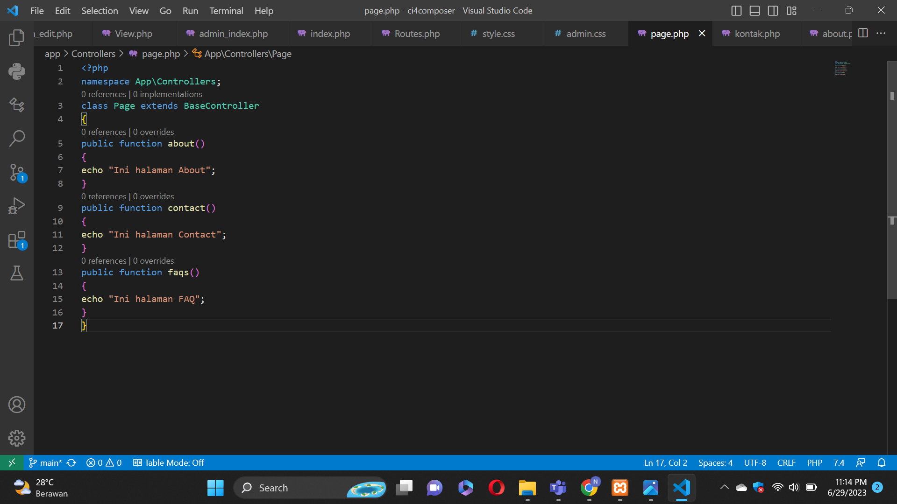
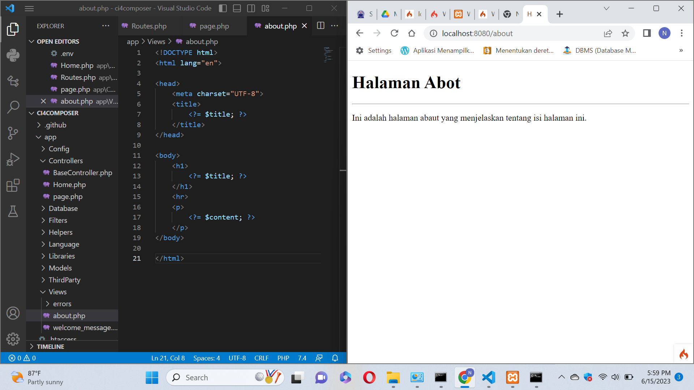
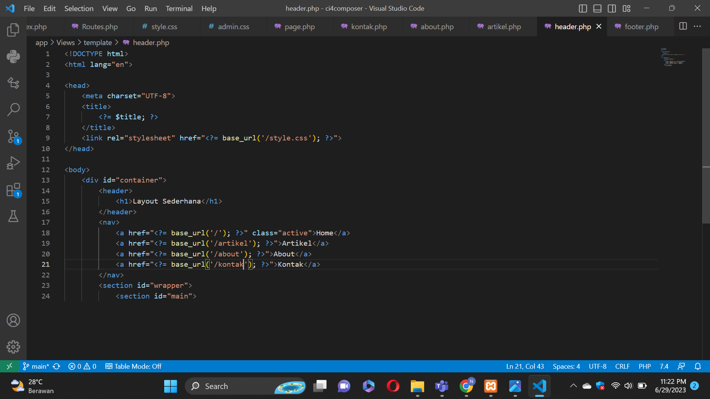

# Lab7Web

### Leman - 312110148
### TI.21.C.1
## PHP FRAMEWORK (CODEIGNITER)

## LANGKAH LANGKAH PRAKTIKUM

Buka XAMPP,pada bagian Apache klik Config (PHP.ini)'<P>'

Pada bagian extention, hilangkan tanda ; (titik koma) pada ekstensi yang akan diaktifkan.'<P>'
Kemudian simpan kembali filenya dan restart Apache web server.'<P>'


•Unduh CODEIGNITER 4 '<P>'
•Extrak file zip Codeigniter ke direktori htdocs/.'<P>'
• Ubah nama direktory framework-4.x.xx menjadi ci4. '<P>'
• Buka browser dengan alamat http://localhost/lab11_ci/ci4/public/ '<P>'


Buka CMD lalu arahkan lokasi direktori sesuai dengan direktori kerja project yang dibuat 
Perintah untuk memanggil CLI CODEIGNITER adalah'<P>'
php spark'<P>'


Mengaktifkan Mode Debugging '<P>'
Codeigniter 4 menyediakan fitur debugging untuk memudahkan developer untuk mengetahui pesan
error apabila terjadi kesalahan dalam membuat kode program.'<P>'
Secara default fitur ini belum aktif. Ketika terjadi error pada aplikasi akan ditampilkan pesan
kesalahan seperti berikut.'<P>'


Ubah nama file env menjadi .env kemudian buka file tersebut dan ubah nilai variabel CI_ENVIRINMENT menjadi development.'<P>'


Untuk mengetahui route yang ditambahkan sudah benar, buka CLI (php spark routes)'<P>'


Selanjutnya adalah membuat Controller Page. Buat file baru dengan nama page.php pada direktori
Controller kemudian isi kodenya seperti berikut.'<P>'

Ini adalah hasilnya'<P>'


Secara default fitur autoroute pada Codeiginiter sudah aktif.'<P>'
Untuk mengubah status autoroute dapat mengubah nilai variabelnya. Untuk menonaktifkan ubah nilai true menjadi false.'<P>'
```php
  {$routes->setAutoRoute(true);}
```
Tambahkan method baru pada Controller Page seperti berikut. '<P>'
public function tos()'<P>'
{'<P>'
echo "ini halaman Term of Services";'<P>'
}'<P>'


Selanjutnya adalam membuat view untuk tampilan web agar lebih menarik. Buat file baru dengan
nama about.php pada direktori view (app/view/about.php)'<P>'
Ubah method about pada class Controller Page menjadi seperti berikut:'<P>'

Ini adalah Hasilnya


Buat file css pada direktori public dengan nama style.css'<P>'


Kemudian buat folder template pada direktori view kemudian buat file header.php dan footer.php
File app/view/template/header.php'<P>'



Selanjutnya refresh tampilan pada alamat http://localhost:8080/about '<P>'
Ini adalah hasilnya '<P>'

